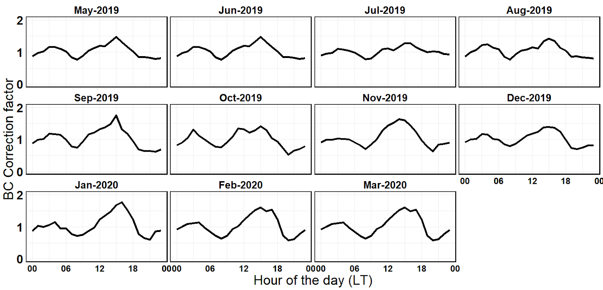

```{r setup, include=FALSE}
knitr::opts_chunk$set(echo = TRUE)
library(tidyverse)
getwd()
here::here()
theme_ts <- list(theme_classic(),
                 theme(legend.text = element_text(size = 18),
                       plot.title = element_text(size = 14, face = "bold"),
                       axis.title = element_text(size = 20, face = "bold"),
                       axis.text = element_text(size = 18, face = "bold"),
                       panel.border = element_rect(colour = "black",
                                                   fill = NA, size = 1.2),
                       strip.background = element_blank(), strip.text = element_blank()))
reg_eqn <- function(x){
  R_sq <- round(as.numeric(x$r.squared), digits = 2)
  int <- round(coef(x)[1], digits = 2)
  slope <- round(coef(x)[2], digits = 2)
  eqn <- paste("y = ", slope, "x + ( ", int, ")")
  return(eqn)
}

```

## Black Carbon (BC) [^1] time of day correction factor (CF)

[^1]: Black Carbon mentioned here means loading corrected Black Carbon.

-   Selected Study area here is ***Malleshwaram***.
-   The concentrations varied, introducing a bias due to diurnal variations and urban background variations.
-   To remove this bias we corrected the concentrations using a multiplicative factor derived by ambient measurements made by AE33 (Magee Scientific model) at the Ambient site (CSTEP).
-   The ambient concentrations were higher during the morning rush hours and decreased during the afternoon, owing to the dynamic boundary layer variations.
-   The correction factor was generated using the BC data derived from the channel 6 of AE33 data by calculating the daytime median concentrations (corresponding to the monitoring period), then at hourly basis we derived the correction factor using the ratio of hourly median and daily median.
-   This multiplicative factor (monthly mean) is used for 'hour of the day correction' and is detailed in Apte et al., (2011).
-   The correction factor was applied to the mobile measurements of black carbon by AE51 alone, since ambient UFP's and CO2 measurements were not available.
-   The mean absolute change in BC concentrations after applying the hour of the day correction factor was 4.05 calculated as mean of the difference between corrected with CF and without it.
-   The monthly median values of CF or the correction factors are shown below.



## Black Carbon vs Black Carbon corrected using the correction factor

- one second 

- one minute average 

- one hour average 

```{r message = FALSE, warning = FALSE}
MAL1_sec <- read.csv("D:/Dropbox/APMfull/MAL_CNG_Paper/MAL1/MAL1_sec.csv", sep = ",") %>%
  select(date, BC_NR_LC, BC_CF, BC_c, Road_type)

MAL2_sec <- read.csv("D:/Dropbox/APMfull/MAL_CNG_Paper/MAL2/MAL2_sec.csv", sep = ",") %>%
  select(date, BC_NR_LC, BC_CF, BC_c, Road_type)

MAL <- rbind(MAL1_sec, MAL2_sec)
MAL$diff <- (MAL$BC_NR_LC - MAL$BC_c)
mean_diff <- mean(MAL$diff, na.rm = TRUE) ## mean absolute change

m <- lm(BC_c ~ BC_NR_LC, MAL)
s <- summary(m)
r <- round(s$adj.r.squared, digits = 2)
MAL$diffSq <- (MAL$BC_c - MAL$BC_NR_LC) ^ 2
mean_diff_sqr <- mean(MAL$diffSq, na.rm = TRUE)
MAL_u <- rbind(data.frame("value" = m$model$BC_c), data.frame("value" = m$model$BC_NR_LC))
nrmse <- round((sqrt(mean_diff_sqr) / mean(MAL_u$value, na.rm = TRUE)) * 100, digits = 2)
rmse <- round(sqrt(mean_diff_sqr), digits = 2)
n <- nrow(data.frame(m$fitted.values))  

scatter_plot <- ggplot(data = MAL, aes(x = BC_NR_LC, y = BC_c)) +
  geom_abline(slope = 1, intercept = 0, color = "black", size = 0.8, linetype = "dashed") +
  geom_point(size = 1.2, color = "red") + 
  geom_smooth(method = lm, size = 1.4, se = FALSE, formula = y ~ x, color = "steelblue") + scale_x_continuous(limits = c(0, 2000)) + scale_y_continuous(limits = c(0, 2000)) + 
  labs(x = expression(paste("BC" ," (", mu, "g", ~m^{-3}, ")")), y = expression(paste("CF applied BC" ," (", mu, "g", ~m^{-3}, ")")))  + theme_ts +
  annotate("text", size = 7, label = expr(paste("N: ", !!n, "; ", R^{2}, ": ", !!r)), x = 500, y = 1700) +
  annotate("text", size = 7, label = expr(paste("BC one-second")), x = 500, y = 1800) +
  annotate("text", size = 7, label = expr(paste("RMSD: ", !!rmse, " ", mu, "g ", ~m^{-3})), x = 500, y = 1500) +  
  annotate("text", size = 7, label = expr(paste("NRMSD: ", !!nrmse, "%")), x = 500, y = 1400) +
  annotate("text", size = 7, label = expr(paste(!!reg_eqn(s))), x = 500, y = 1600)

scatter_plot

MAL_minute <- MAL %>%
  select(date, everything(), - Road_type) %>%
  mutate(date = lubridate::ceiling_date(as.POSIXct(date, format = "%Y-%m-%d %H:%M:%S", tz = "Asia/Kolkata"), unit = "minute")) %>%
  group_by(date) %>%
  summarize_all(funs(mean), na.rm = TRUE)

  
m <- lm(BC_c ~ BC_NR_LC, MAL_minute)
s <- summary(m)
r <- round(s$adj.r.squared, digits = 2)
MAL_minute$diffSq <- (MAL_minute$BC_c - MAL_minute$BC_NR_LC) ^ 2
mean_diff_sqr <- mean(MAL_minute$diffSq, na.rm = TRUE)
MAL_min_u <- rbind(data.frame("value" = m$model$BC_c), data.frame("value" = m$model$BC_NR_LC))
nrmse <- round((sqrt(mean_diff_sqr) / mean(MAL_min_u$value, na.rm = TRUE)) * 100, digits = 2)
rmse <- round(sqrt(mean_diff_sqr), digits = 2)
n <- nrow(data.frame(m$fitted.values))  

scatter_plot2 <- ggplot(data = MAL_minute, aes(x = BC_NR_LC, y = BC_c)) +
  geom_abline(slope = 1, intercept = 0, color = "black", size = 0.8, linetype = "dashed") +
  geom_point(size = 1.2, color = "red") + 
  geom_smooth(method = lm, size = 1.4, se = FALSE, formula = y ~ x, color = "steelblue") + scale_x_continuous(limits = c(0, 2000)) + scale_y_continuous(limits = c(0, 2000)) + 
  labs(x = expression(paste("BC" ," (", mu, "g", ~m^{-3}, ")")), y = expression(paste("CF applied BC" ," (", mu, "g", ~m^{-3}, ")")))  + theme_ts +
  annotate("text", size = 7, label = expr(paste("N: ", !!n, "; ", R^{2}, ": ", !!r)), x = 500, y = 1700) +
  annotate("text", size = 7, label = expr(paste("BC one-minute average")), x = 500, y = 1800) +
  annotate("text", size = 7, label = expr(paste("RMSD: ", !!rmse, " ", mu, "g ", ~m^{-3})), x = 500, y = 1500) +  
  annotate("text", size = 7, label = expr(paste("NRMSD: ", !!nrmse, "%")), x = 500, y = 1400) +
  annotate("text", size = 7, label = expr(paste(!!reg_eqn(s))), x = 500, y = 1600)

scatter_plot2


MAL_hour <- MAL %>%
  select(date, everything(), - Road_type) %>%
  mutate(date = lubridate::ceiling_date(as.POSIXct(date, format = "%Y-%m-%d %H:%M:%S", tz = "Asia/Kolkata"), unit = "hour")) %>%
  group_by(date) %>%
  summarize_all(funs(mean), na.rm = TRUE)

  
m <- lm(BC_c ~ BC_NR_LC, MAL_hour)
s <- summary(m)
r <- round(s$adj.r.squared, digits = 2)
MAL_hour$diffSq <- (MAL_hour$BC_c - MAL_hour$BC_NR_LC) ^ 2
mean_diff_sqr <- mean(MAL_hour$diffSq, na.rm = TRUE)
MAL_h_u <- rbind(data.frame("value" = m$model$BC_c), data.frame("value" = m$model$BC_NR_LC))
nrmse <- round((sqrt(mean_diff_sqr) / mean(MAL_h_u$value, na.rm = TRUE)) * 100, digits = 2)
rmse <- round(sqrt(mean_diff_sqr), digits = 2)
n <- nrow(data.frame(m$fitted.values))  

scatter_plot3 <- ggplot(data = MAL_hour, aes(x = BC_NR_LC, y = BC_c)) +
  geom_abline(slope = 1, intercept = 0, color = "black", size = 0.8, linetype = "dashed") +
  geom_point(size = 1.2, color = "red") + 
  geom_smooth(method = lm, size = 1.4, se = FALSE, formula = y ~ x, color = "steelblue") + scale_x_continuous(limits = c(0, 2000)) + scale_y_continuous(limits = c(0, 2000)) + 
  labs(x = expression(paste("BC" ," (", mu, "g", ~m^{-3}, ")")), y = expression(paste("CF applied BC" ," (", mu, "g", ~m^{-3}, ")")))  + theme_ts +
  annotate("text", size = 7, label = expr(paste("N: ", !!n, "; ", R^{2}, ": ", !!r)), x = 500, y = 1700) +
  annotate("text", size = 7, label = expr(paste("BC one-hour average")), x = 500, y = 1800) +
  annotate("text", size = 7, label = expr(paste("RMSD: ", !!rmse, " ", mu, "g ", ~m^{-3})), x = 500, y = 1500) +  
  annotate("text", size = 7, label = expr(paste("NRMSD: ", !!nrmse, "%")), x = 500, y = 1400) +
  annotate("text", size = 7, label = expr(paste(!!reg_eqn(s))), x = 500, y = 1600)

scatter_plot3


```


## Ambient and Mobile data

- We collected mobile data at 1 s, so here we picked up 1 percentile values from each hour (ex- in 1 hour we have 3600 values we picked up 1 percentile values or ~ 36 values), averaged it to minute and compared it with each minute of ambient data. 

### 1 percentile

```{r message = FALSE, warning = FALSE}
setwd("D:/Dropbox/APMfull/Colocation CSTEP/CSTEP_co-location_2020/Exp_9_2020_01_15/AE33_CSTEP")
ae33_cstep <- data.frame()
dir <- "D:/Dropbox/APMfull/Colocation CSTEP/CSTEP_co-location_2020/Exp_9_2020_01_15/AE33_CSTEP/"
dat_list <- list.files(dir, pattern = "\\.dat$")
### For all shapefiles in a folder
for(i in seq_along(dat_list))ae33_cstep <- rbind(ae33_cstep, 
                                                 data.frame(read.table(dat_list[i], 
                                                                       header = TRUE, 
                                                                       skip = 4)))
ae33_cstep$date <- with(ae33_cstep, as.POSIXct(paste(as.Date(Date.yyyy.MM.dd.., 
                                                             format = '%Y/%m/%d',
                                                             tz = "Asia/Kolkata"), 
                                                     Time.hh.mm.ss..)))
ae33_cstep1 <- ae33_cstep 
ae33_cstep <- ae33_cstep %>%
  mutate(AE33_cstep = BC6. / 1000,
         UVPM_cstep = BC1. / 1000,
         Date = as.Date(date, format = '%Y-%m-%d', tz ="Asia/Kolkata"),
         hour = as.numeric(as.character(format(date, "%H"))),
         month = as.numeric(as.character(format(date, "%m")))) %>%
  filter(hour <= 13 & hour >= 9) %>%
  filter(Status. == 0 | Status. == 256 | Status. == 128) %>%
  select(date, Date, AE33_cstep, UVPM_cstep, month) 
ae33_cstep <- subset(ae33_cstep, AE33_cstep > 0)


ae33_cstep <- ae33_cstep %>%
  filter(Date != as.Date("2019-08-13") & Date != as.Date("2019-08-18") &
           Date != as.Date("2019-08-14") & Date != as.Date("2019-08-19") &
           Date != as.Date("2019-08-20") & Date != as.Date("2019-08-21") &
           Date != as.Date("2019-08-30") & Date != as.Date("2019-08-31") &
           Date != as.Date("2019-09-01") & Date != as.Date("2019-09-02"))
ae33_cstep_jan <- subset(ae33_cstep, Date >= as.Date("2020-01-01"))
ae33_cstep_jan$month <- case_when(ae33_cstep_jan$month == "1" ~ "Jan",
                                  ae33_cstep_jan$month == "2" ~ "Feb",
                                  TRUE ~ as.character(ae33_cstep_jan$month))
ae33_cstep$month <- case_when(ae33_cstep$month == "7" ~ "Jul",
                              ae33_cstep$month == "8" ~ "Aug",
                              ae33_cstep$month == "9" ~ "Sep",
                              ae33_cstep$month == "10" ~ "Oct",
                              ae33_cstep$month == "11" ~ "Nov",
                              ae33_cstep$month == "12" ~ "Dec",
                              ae33_cstep$month == "1" ~ "Jan",
                              ae33_cstep$month == "2" ~ "Feb",
                              TRUE ~ as.character(ae33_cstep$month))
ae33_cstep <- rbind(ae33_cstep, ae33_cstep_jan)


MAL_ry <- MAL %>%
  filter(!is.na(BC_NR_LC)) %>%
  mutate(hour = format(strptime(date, "%Y-%m-%d %H:%M:%S"), "%Y-%m-%d %H:00:00"),
         hour = as.POSIXct(hour, format = "%Y-%m-%d %H:%M:%S", tz = "Asia/Kolkata")) %>%
  group_by(hour) %>%
  mutate_if(is.numeric, funs(q1 = quantile(., .01), 
                             n = sum(!is.na(.))), na.rm = TRUE) %>%
  mutate(BC_LC = ifelse(BC_NR_LC <= BC_NR_LC_q1, BC_NR_LC, NA),
         BC_Fc = ifelse(BC_c <= BC_c_q1, BC_c, NA))

MAL_sub <- MAL_ry %>%
  select(date, hour, BC_LC, BC_Fc) %>%
  filter(!is.na(BC_LC)) %>%
  group_by(hour) %>%
  mutate_if(is.numeric, funs(n = sum(!is.na(.))), na.rm = TRUE) %>%
  mutate(date = lubridate::ceiling_date(as.POSIXct(date, 
                                                   format = "%Y-%m-%d %H:%M:%S", 
                                                   tz = "Asia/Kolkata"), "minutes")) %>%
  select(date, BC_LC, BC_Fc) %>%
  group_by(date) %>%
  summarise_all(funs(median, mean, sd, IQR), na.rm = TRUE) %>%
  left_join(ae33_cstep, by = "date") %>%
  filter(!is.na(AE33_cstep)) %>%
  select(date, BC_LC_mean, BC_Fc_mean, BC_LC_median, BC_Fc_median, AE33_cstep, UVPM_cstep)
  

m <- lm(BC_LC_mean ~ AE33_cstep, MAL_sub)
s <- summary(m)
r <- round(s$adj.r.squared, digits = 2)
MAL_sub$diffSq <- (MAL_sub$BC_LC_mean - MAL_sub$AE33_cstep) ^ 2
mean_diff_sqr <- mean(MAL_sub$diffSq, na.rm = TRUE)
MAL_su <- rbind(data.frame("value" = m$model$BC_LC_mean), data.frame("value" = m$model$AE33_cstep))
nrmse <- round((sqrt(mean_diff_sqr) / mean(MAL_su$value, na.rm = TRUE)) * 100, digits = 2)
rmse <- round(sqrt(mean_diff_sqr), digits = 2)
n <- nrow(data.frame(m$fitted.values))  

scatter_plot11 <- ggplot(data = MAL_sub, aes(x = AE33_cstep, y = BC_LC_mean)) + 
  geom_abline(slope = 1, intercept = 0, color = "black", size = 0.8, linetype = "dashed") +
  geom_point(size = 1.2, color = "red") + 
  geom_smooth(method = lm, size = 1.4, se = FALSE, formula = y ~ x, color = "steelblue") +
  scale_x_continuous(limits = c(0, 35)) + scale_y_continuous(limits = c(0, 35)) + 
  labs(x = expression(paste("Ambient BC" ," (", mu, "g", ~m^{-3}, ")")), y = expression(paste("Mobile BC" ," (", mu, "g", ~m^{-3}, ")")))  + theme_ts +
  annotate("text", size = 8, label = expr(paste("N: ", !!n, "; ", R^{2}, ": ", !!r)), x = 5, y = 23) +
  annotate("text", size = 8, label = expr(paste("BC one-minute average")), x = 5, y = 26) +
  annotate("text", size = 8, label = expr(paste("RMSD: ", !!rmse, " ", mu, "g ", ~m^{-3})), x = 5, y = 17) +  
  annotate("text", size = 8, label = expr(paste("NRMSD: ", !!nrmse, "%")), x = 5, y = 14) +
  annotate("text", size = 8, label = expr(paste(!!reg_eqn(s))), x = 5, y = 20)

scatter_plot11

MAL_sub_hour <- openair::timeAverage(MAL_sub, avg.time = "1 hour")

m <- lm(BC_LC_mean ~ AE33_cstep, MAL_sub_hour)
s <- summary(m)
r <- round(s$adj.r.squared, digits = 2)
MAL_sub_hour$diffSq <- (MAL_sub_hour$BC_LC_mean - MAL_sub_hour$AE33_cstep) ^ 2
mean_diff_sqr <- mean(MAL_sub_hour$diffSq, na.rm = TRUE)
MAL_h_su <- rbind(data.frame("value" = m$model$BC_LC_mean), data.frame("value" = m$model$AE33_cstep))
nrmse <- round((sqrt(mean_diff_sqr) / mean(MAL_h_su$value, na.rm = TRUE)) * 100, digits = 2)
rmse <- round(sqrt(mean_diff_sqr), digits = 2)
n <- nrow(data.frame(m$fitted.values))  

scatter_plot12 <- ggplot(data = MAL_sub_hour, aes(x = AE33_cstep, y = BC_LC_mean)) + 
  geom_abline(slope = 1, intercept = 0, color = "black", size = 0.8, linetype = "dashed") +
  geom_point(size = 1.2, color = "red") + 
  geom_smooth(method = lm, size = 1.4, se = FALSE, formula = y ~ x, color = "steelblue") +
  scale_x_continuous(limits = c(0, 35)) + scale_y_continuous(limits = c(0, 35)) + 
  labs(x = expression(paste("Ambient BC" ," (", mu, "g", ~m^{-3}, ")")), y = expression(paste("Mobile BC" ," (", mu, "g", ~m^{-3}, ")")))  + theme_ts +
  annotate("text", size = 8, label = expr(paste("N: ", !!n, "; ", R^{2}, ": ", !!r)), x = 5, y = 23) +
  annotate("text", size = 8, label = expr(paste("BC one-hour average")), x = 5, y = 26) +
  annotate("text", size = 8, label = expr(paste("RMSD: ", !!rmse, " ", mu, "g ", ~m^{-3})), x = 5, y = 17) +  
  annotate("text", size = 8, label = expr(paste("NRMSD: ", !!nrmse, "%")), x = 5, y = 14) +
  annotate("text", size = 8, label = expr(paste(!!reg_eqn(s))), x = 5, y = 20)

scatter_plot12

```

### 10 percentile

```{r message = FALSE, warning = FALSE}

MAL_hour <- MAL %>%
  filter(!is.na(BC_NR_LC)) %>%
  mutate(hour = format(strptime(date, "%Y-%m-%d %H:%M:%S"), "%Y-%m-%d %H:00:00"),
         hour = as.POSIXct(hour, format = "%Y-%m-%d %H:%M:%S", tz = "Asia/Kolkata")) %>%
  group_by(hour) %>%
  mutate_if(is.numeric, funs(q1 = quantile(., .1), 
                             n = sum(!is.na(.))), na.rm = TRUE) %>%
  mutate(BC_LC = ifelse(BC_NR_LC <= BC_NR_LC_q1, BC_NR_LC, NA),
         BC_Fc = ifelse(BC_c <= BC_c_q1, BC_c, NA))

MAL_10 <- MAL_hour

MAL_sub <- MAL_hour %>%
  select(date, hour, BC_LC, BC_Fc) %>%
  filter(!is.na(BC_LC)) %>%
  group_by(hour) %>%
  mutate_if(is.numeric, funs(n = sum(!is.na(.))), na.rm = TRUE) %>%
  mutate(date = lubridate::ceiling_date(as.POSIXct(date, 
                                                   format = "%Y-%m-%d %H:%M:%S", 
                                                   tz = "Asia/Kolkata"), "minutes")) %>%
  select(date, BC_LC, BC_Fc) %>%
  group_by(date) %>%
  summarise_all(funs(median, mean, sd, IQR), na.rm = TRUE) %>%
  left_join(ae33_cstep, by = "date") %>%
  filter(!is.na(AE33_cstep)) %>%
  select(date, BC_LC_mean, BC_Fc_mean, BC_LC_median, BC_Fc_median, AE33_cstep, UVPM_cstep)
  

m <- lm(BC_LC_mean ~ AE33_cstep, MAL_sub)
s <- summary(m)
r <- round(s$adj.r.squared, digits = 2)
MAL_sub$diffSq <- (MAL_sub$BC_LC_mean - MAL_sub$AE33_cstep) ^ 2
mean_diff_sqr <- mean(MAL_sub$diffSq, na.rm = TRUE)
MAL_su <- rbind(data.frame("value" = m$model$BC_LC_mean), data.frame("value" = m$model$AE33_cstep))
nrmse <- round((sqrt(mean_diff_sqr) / mean(MAL_su$value, na.rm = TRUE)) * 100, digits = 2)
rmse <- round(sqrt(mean_diff_sqr), digits = 2)
n <- nrow(data.frame(m$fitted.values))  

scatter_plot11 <- ggplot(data = MAL_sub, aes(x = AE33_cstep, y = BC_LC_mean)) + 
  geom_abline(slope = 1, intercept = 0, color = "black", size = 0.8, linetype = "dashed") +
  geom_point(size = 1.2, color = "red") + 
  geom_smooth(method = lm, size = 1.4, se = FALSE, formula = y ~ x, color = "steelblue") +
  scale_x_continuous(limits = c(0, 35)) + scale_y_continuous(limits = c(0, 35)) + 
  labs(x = expression(paste("Ambient BC" ," (", mu, "g", ~m^{-3}, ")")), y = expression(paste("Mobile BC" ," (", mu, "g", ~m^{-3}, ")")))  + theme_ts +
  annotate("text", size = 8, label = expr(paste("N: ", !!n, "; ", R^{2}, ": ", !!r)), x = 5, y = 29) +
  annotate("text", size = 8, label = expr(paste("BC one-minute average")), x = 5, y = 32) +
  annotate("text", size = 8, label = expr(paste("RMSD: ", !!rmse, " ", mu, "g ", ~m^{-3})), x = 5, y = 23) +  
  annotate("text", size = 8, label = expr(paste("NRMSD: ", !!nrmse, "%")), x = 5, y = 20) +
  annotate("text", size = 8, label = expr(paste(!!reg_eqn(s))), x = 5, y = 26)

scatter_plot11

MAL_sub_hour <- openair::timeAverage(MAL_sub, avg.time = "1 hour")

m <- lm(BC_LC_mean ~ AE33_cstep, MAL_sub_hour)
s <- summary(m)
r <- round(s$adj.r.squared, digits = 2)
MAL_sub_hour$diffSq <- (MAL_sub_hour$BC_LC_mean - MAL_sub_hour$AE33_cstep) ^ 2
mean_diff_sqr <- mean(MAL_sub_hour$diffSq, na.rm = TRUE)
MAL_h_su <- rbind(data.frame("value" = m$model$BC_LC_mean), data.frame("value" = m$model$AE33_cstep))
nrmse <- round((sqrt(mean_diff_sqr) / mean(MAL_h_su$value, na.rm = TRUE)) * 100, digits = 2)
rmse <- round(sqrt(mean_diff_sqr), digits = 2)
n <- nrow(data.frame(m$fitted.values))  

scatter_plot12 <- ggplot(data = MAL_sub_hour, aes(x = AE33_cstep, y = BC_LC_mean)) + 
  geom_abline(slope = 1, intercept = 0, color = "black", size = 0.8, linetype = "dashed") +
  geom_point(size = 1.2, color = "red") + 
  geom_smooth(method = lm, size = 1.4, se = FALSE, formula = y ~ x, color = "steelblue") +
  scale_x_continuous(limits = c(0, 35)) + scale_y_continuous(limits = c(0, 35)) + 
  labs(x = expression(paste("Ambient BC" ," (", mu, "g", ~m^{-3}, ")")), y = expression(paste("Mobile BC" ," (", mu, "g", ~m^{-3}, ")")))  + theme_ts +
  annotate("text", size = 8, label = expr(paste("N: ", !!n, "; ", R^{2}, ": ", !!r)), x = 5, y = 29) +
  annotate("text", size = 8, label = expr(paste("BC one-hour average")), x = 5, y = 32) +
  annotate("text", size = 8, label = expr(paste("RMSD: ", !!rmse, " ", mu, "g ", ~m^{-3})), x = 5, y = 23) +  
  annotate("text", size = 8, label = expr(paste("NRMSD: ", !!nrmse, "%")), x = 5, y = 20) +
  annotate("text", size = 8, label = expr(paste(!!reg_eqn(s))), x = 5, y = 26)

scatter_plot12

```

### 30 percentile

```{r message = FALSE, warning = FALSE}

MAL_hour <- MAL %>%
  filter(!is.na(BC_NR_LC)) %>%
  mutate(hour = format(strptime(date, "%Y-%m-%d %H:%M:%S"), "%Y-%m-%d %H:00:00"),
         hour = as.POSIXct(hour, format = "%Y-%m-%d %H:%M:%S", tz = "Asia/Kolkata")) %>%
  group_by(hour) %>%
  mutate_if(is.numeric, funs(q1 = quantile(., .3), 
                             n = sum(!is.na(.))), na.rm = TRUE) %>%
  mutate(BC_LC = ifelse(BC_NR_LC <= BC_NR_LC_q1, BC_NR_LC, NA),
         BC_Fc = ifelse(BC_c <= BC_c_q1, BC_c, NA))

MAL_sub <- MAL_hour %>%
  select(date, hour, BC_LC, BC_Fc) %>%
  filter(!is.na(BC_LC)) %>%
  group_by(hour) %>%
  mutate_if(is.numeric, funs(n = sum(!is.na(.))), na.rm = TRUE) %>%
  mutate(date = lubridate::ceiling_date(as.POSIXct(date, 
                                                   format = "%Y-%m-%d %H:%M:%S", 
                                                   tz = "Asia/Kolkata"), "minutes")) %>%
  select(date, BC_LC, BC_Fc) %>%
  group_by(date) %>%
  summarise_all(funs(median, mean, sd, IQR), na.rm = TRUE) %>%
  left_join(ae33_cstep, by = "date") %>%
  filter(!is.na(AE33_cstep)) %>%
  select(date, BC_LC_mean, BC_Fc_mean, BC_LC_median, BC_Fc_median, AE33_cstep, UVPM_cstep)
  

m <- lm(BC_LC_mean ~ AE33_cstep, MAL_sub)
s <- summary(m)
r <- round(s$adj.r.squared, digits = 2)
MAL_sub$diffSq <- (MAL_sub$BC_LC_mean - MAL_sub$AE33_cstep) ^ 2
mean_diff_sqr <- mean(MAL_sub$diffSq, na.rm = TRUE)
MAL_su <- rbind(data.frame("value" = m$model$BC_LC_mean), data.frame("value" = m$model$AE33_cstep))
nrmse <- round((sqrt(mean_diff_sqr) / mean(MAL_su$value, na.rm = TRUE)) * 100, digits = 2)
rmse <- round(sqrt(mean_diff_sqr), digits = 2)
n <- nrow(data.frame(m$fitted.values))  

scatter_plot11 <- ggplot(data = MAL_sub, aes(x = AE33_cstep, y = BC_LC_mean)) + 
  geom_abline(slope = 1, intercept = 0, color = "black", size = 0.8, linetype = "dashed") +
  geom_point(size = 1.2, color = "red") + 
  geom_smooth(method = lm, size = 1.4, se = FALSE, formula = y ~ x, color = "steelblue") +
  scale_x_continuous(limits = c(0, 35)) + scale_y_continuous(limits = c(0, 35)) + 
  labs(x = expression(paste("Ambient BC" ," (", mu, "g", ~m^{-3}, ")")), y = expression(paste("Mobile BC" ," (", mu, "g", ~m^{-3}, ")")))  + theme_ts +
  annotate("text", size = 8, label = expr(paste("N: ", !!n, "; ", R^{2}, ": ", !!r)), x = 5, y = 29) +
  annotate("text", size = 8, label = expr(paste("BC one-minute average")), x = 5, y = 32) +
  annotate("text", size = 8, label = expr(paste("RMSD: ", !!rmse, " ", mu, "g ", ~m^{-3})), x = 5, y = 23) +  
  annotate("text", size = 8, label = expr(paste("NRMSD: ", !!nrmse, "%")), x = 5, y = 20) +
  annotate("text", size = 8, label = expr(paste(!!reg_eqn(s))), x = 5, y = 26)

scatter_plot11

MAL_sub_hour <- openair::timeAverage(MAL_sub, avg.time = "1 hour")

m <- lm(BC_LC_mean ~ AE33_cstep, MAL_sub_hour)
s <- summary(m)
r <- round(s$adj.r.squared, digits = 2)
MAL_sub_hour$diffSq <- (MAL_sub_hour$BC_LC_mean - MAL_sub_hour$AE33_cstep) ^ 2
mean_diff_sqr <- mean(MAL_sub_hour$diffSq, na.rm = TRUE)
MAL_h_su <- rbind(data.frame("value" = m$model$BC_LC_mean), data.frame("value" = m$model$AE33_cstep))
nrmse <- round((sqrt(mean_diff_sqr) / mean(MAL_h_su$value, na.rm = TRUE)) * 100, digits = 2)
rmse <- round(sqrt(mean_diff_sqr), digits = 2)
n <- nrow(data.frame(m$fitted.values))  

scatter_plot12 <- ggplot(data = MAL_sub_hour, aes(x = AE33_cstep, y = BC_LC_mean)) + 
  geom_abline(slope = 1, intercept = 0, color = "black", size = 0.8, linetype = "dashed") +
  geom_point(size = 1.2, color = "red") + 
  geom_smooth(method = lm, size = 1.4, se = FALSE, formula = y ~ x, color = "steelblue") +
  scale_x_continuous(limits = c(0, 35)) + scale_y_continuous(limits = c(0, 35)) + 
  labs(x = expression(paste("Ambient BC" ," (", mu, "g", ~m^{-3}, ")")), y = expression(paste("Mobile BC" ," (", mu, "g", ~m^{-3}, ")")))  + theme_ts +
  annotate("text", size = 8, label = expr(paste("N: ", !!n, "; ", R^{2}, ": ", !!r)), x = 5, y = 29) +
  annotate("text", size = 8, label = expr(paste("BC one-hour average")), x = 5, y = 32) +
  annotate("text", size = 8, label = expr(paste("RMSD: ", !!rmse, " ", mu, "g ", ~m^{-3})), x = 5, y = 23) +  
  annotate("text", size = 8, label = expr(paste("NRMSD: ", !!nrmse, "%")), x = 5, y = 20) +
  annotate("text", size = 8, label = expr(paste(!!reg_eqn(s))), x = 5, y = 26)

scatter_plot12

```

## 10 percentile of Mobile monitoring data used for generating Correction Factor

- Mean absolute change is 0.31

```{r message = FALSE, warning = FALSE}
MAL_CF <- MAL_10
MAL_CF <- MAL_CF %>%
  select(date, BC_LC, BC_NR_LC) %>%
  mutate(day = as.Date(date, format = "%Y-%m-%d", tz = "Asia/Kolkata"),
         month = format(as.POSIXct(date), "%Y-%b-01"), hour_num = format(as.POSIXct(date), "%H")) %>%
  group_by(day) %>%
  mutate(median_day = median(BC_LC, na.rm = TRUE)) %>%
  mutate(CF = median_day / BC_LC) %>%
  group_by(hour_num, month) %>%
  mutate(median_CF = median(CF, na.rm = TRUE)) %>%
  mutate(BC_NR_LC_c = BC_NR_LC * median_CF)

mean_ab_ch <- mean((MAL_CF$BC_NR_LC_c - MAL_CF$BC_NR_LC), na.rm = TRUE)


m <- lm(BC_NR_LC_c ~ BC_NR_LC, MAL_CF)
s <- summary(m)
r <- round(s$adj.r.squared, digits = 2)
MAL_CF$diffSq <- (MAL_CF$BC_NR_LC_c - MAL_CF$BC_NR_LC) ^ 2
mean_diff_sqr <- mean(MAL_CF$diffSq, na.rm = TRUE)
MAL_u <- rbind(data.frame("value" = m$model$BC_NR_LC_c), data.frame("value" = m$model$BC_NR_LC))
nrmse <- round((sqrt(mean_diff_sqr) / mean(MAL_u$value, na.rm = TRUE)) * 100, digits = 2)
rmse <- round(sqrt(mean_diff_sqr), digits = 2)
n <- nrow(data.frame(m$fitted.values))  

scatter_plot24 <- ggplot(data = MAL_CF, aes(x = BC_NR_LC, y = BC_NR_LC_c)) +
  geom_abline(slope = 1, intercept = 0, color = "black", size = 0.8, linetype = "dashed") +
  geom_point(size = 1.2, color = "red") + 
  geom_smooth(method = lm, size = 1.4, se = FALSE, formula = y ~ x, color = "steelblue") + scale_x_continuous(limits = c(0, 2000)) + scale_y_continuous(limits = c(0, 2000)) + 
  labs(x = expression(paste("BC" ," (", mu, "g", ~m^{-3}, ")")), y = expression(paste("CF applied BC" ," (", mu, "g", ~m^{-3}, ")")))  + theme_ts +
  annotate("text", size = 7, label = expr(paste("N: ", !!n, "; ", R^{2}, ": ", !!r)), x = 500, y = 1700) +
  annotate("text", size = 7, label = expr(paste("BC", " one-second")), x = 500, y = 1800) +
  annotate("text", size = 7, label = expr(paste("RMSD: ", !!rmse, " ", mu, "g ", ~m^{-3})), x = 500, y = 1500) +  
  annotate("text", size = 7, label = expr(paste("NRMSD: ", !!nrmse, "%")), x = 500, y = 1400) +
  annotate("text", size = 7, label = expr(paste(!!reg_eqn(s))), x = 500, y = 1600)

scatter_plot24

```


